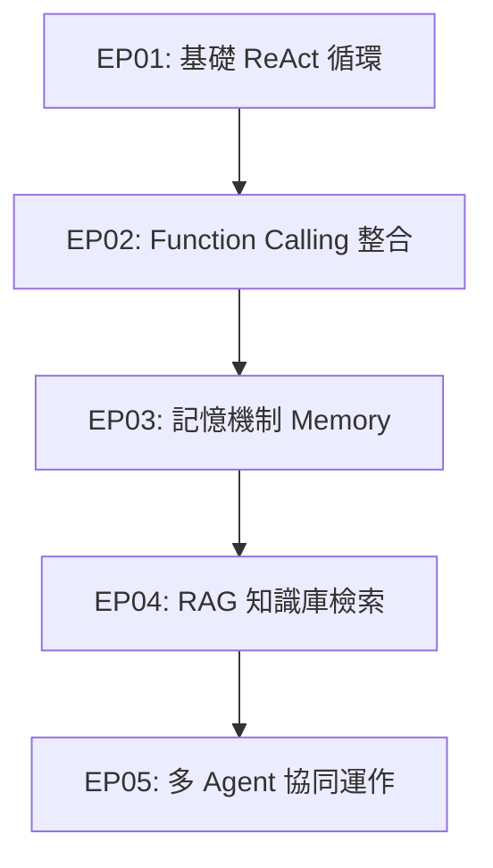

# AI Agent 專案工作藍圖 (Project Blueprint)

本專案旨在透過「動手實作」與「循序漸進」的方式，從零開始理解並學習 AI Agent 的核心概念與設計模式。

---

## 🗺️ 學習與實作路線圖 (Roadmap)

### 📍 Stage 1: 基礎 ReAct (Reasoning & Action) Agent (當前目標)
* **目標**：從零手寫 ReAct 循環，理解 Agent 如何自主思考、選擇工具、觀察結果。
* **關鍵實作**：
  - [x] 設計 System Prompt 讓大模型理解 ReAct 規則 (Thought -> Action -> Observation)
  - [x] 提供簡單的自訂 Python 函數作為 Tool (如計算機、模擬搜尋)
  - [x] 實作 Agent Loop 控制器，解析模型輸出並調用 Tool
  - [x] 使用彩色終端輸出，視覺化展示思考過程

### 📍 Stage 2: 工具與函數調用 (Function Calling)
* **目標**：從正則表達式解析/純文字 Prompt 轉換成原生的 Function Calling 機制。
* **關鍵實作**：
  - 學習如何將 Python 函數轉換成 API 規範的 JSON Schema
  - 使用 Gemini / OpenAI 的 Native Function Calling
  - 提升工具調用的穩定性與結構化參數解析

### 📍 Stage 3: 記憶與狀態管理 (Memory & State)
* **目標**：讓 Agent 擁有短期記憶（對話歷史）與長期記憶（用戶偏好/外部資料庫）。
* **關鍵實作**：
  - 實作滑動視窗 (Sliding Window) 或摘要型記憶以避免 Token 爆炸
  - 儲存對話歷史到本地 JSON / SQLite
  - 建立簡單的用戶 Profile 記憶

### 📍 Stage 4: 檢索增強生成 (RAG) 整合
* **目標**：讓 Agent 能查閱外部私有文件，回答專業領域問題。
* **關鍵實作**：
  - 文件切片 (Chunking) 與向量化 (Embedding)
  - 串接 Vector Database (如 ChromaDB, FAISS)
  - 實作「檢索工具」供 Agent 自主調用

### 📍 Stage 5: 多 Agent 協作 (Multi-Agent System)
* **目標**：將複雜任務拆解，讓多個不同角色的 Agent 協同合作完成任務。
* **關鍵實作**：
  - 角色定義 (Role Playing) 與任務分配
  - 實作路由機制 (Routing) 或群聊機制 (Group Chat)
  - 引入人類反饋機制 (Human-in-the-loop)

---

## 🛠️ 開發環境與架構

* **程式語言**：Python 3.10+
* **核心依賴**：
  - `google-generativeai` (使用 Gemini-2.5-flash / Gemini-1.5-flash 作為大腦)
  - `python-dotenv` (環境變數管理)
  - `colorama` (終端機彩化)
* **專案目錄架構**：
  - [x] `README.md` - 專案導覽與概念說明
  - [x] `agents.md` - 本工作藍圖
  - [x] `requirements.txt` - 依賴包定義
  - [x] `tools.py` - 自訂工具庫
  - [x] `simple_agent.py` - ReAct 核心邏輯
